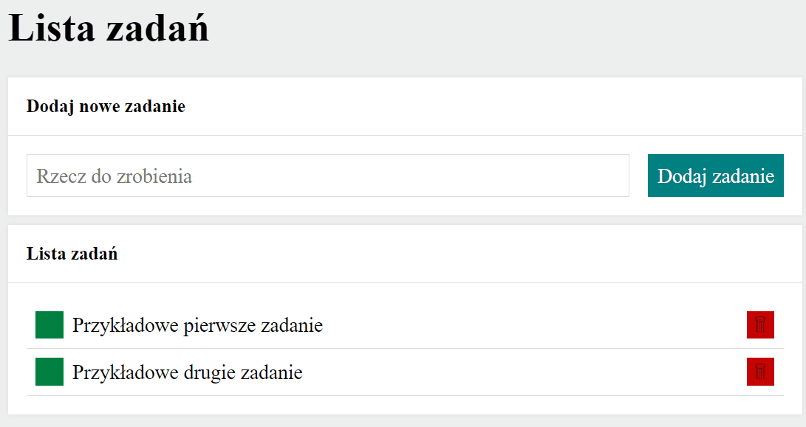

# Wojciech K - Lista zadań
A simple task-to-do list created in HTML, CSS and JavaScript
## Demo

https://wojtekkkwojtek.github.io/Tasks-list/
### Description
Here is a simple tasks list. The task-to-do list allows you to enter a new task by typing it in the form 
and clicking on "Enter" or clicking on the button "Dodaj zadanie". 
You can easily manage your tasks. It's up to you whether you delete one (using the red button) or 
mark a task as done (using the green button).  
